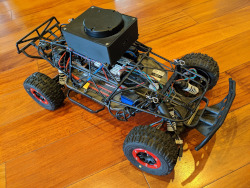

<h1>Jiggle SLAM</h1>



Jiggle Slam is a ROS2 package targeting services for mobile robots with 2D lidar.  It targets high speed robots with modest processing power where there are unique challenges like fast response times and severe lidar warping due to dynamic robot movement.

Warning: Jiggle SLAM is in early development. Use at your own risk

- Fast lidar matching
- Dewarping
- Lidar Odometry
- Slam loop closure

<h2>Feature Status</h2>

| Module | Feature |  Implemented |
|-|-|-|
| lidar-odometer 
|| 2-D Scan Matching | X 
|| Dewarp | X 
|| Config Dewarp | X 
|| Publish to lidar TF | X 
|| Publish Untwisted Scans | X
|| Skip computing pointcloud2 if there are no subscribers
|| Config TF Frames
|| Integrate with ODOM speed for initial match guess
|| Detect Slippage (ODOM/LIDAR/IMU Discrepencies)
|| Prune Scans for Performance
|| Merge frames
| localizer 
|| Loop Closure | Needs porting
|| Publish map->lidar_odom to TF


<h2>Useful Notes</h2>
Test with ros1 bags by converting them with rosbags-convert

```
pip install rosbags-convert
rosbags-convert my.bag
```

